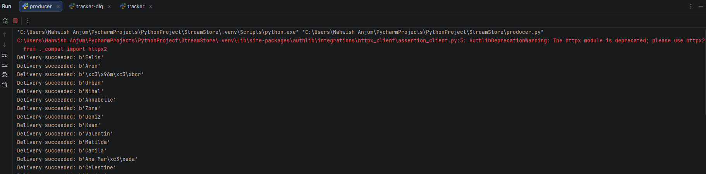
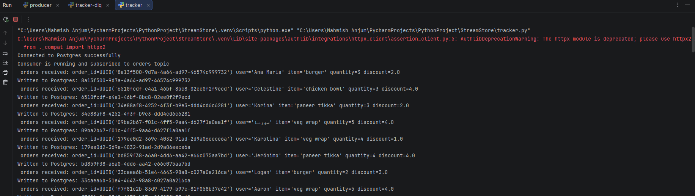
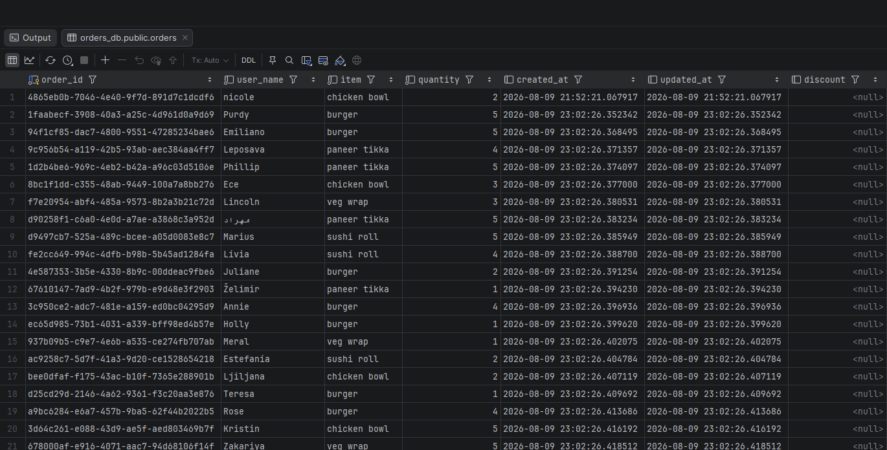
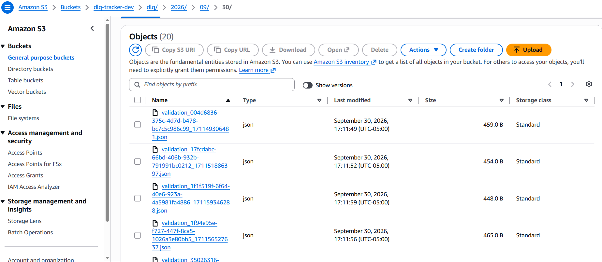

# StreamStore — Kafka Order Event Pipeline

A Kafka-based order-events pipeline built around schema-safe evolution: every message is Avro-encoded, checked against Confluent Schema Registry under `FULL` compatibility, validated against business rules, and routed to a dead-letter queue on failure instead of taking the pipeline down. Designed the way a real order-ingestion service would be — producer and consumer evolve independently, and neither one can break the other.

## Architecture

```
                         ┌─────────────────┐
                         │  Schema Registry │
                         │   (port 8081)    │
                         └────────┬─────────┘
                                  │ register / fetch schema
                                  │
┌────────────┐   Avro bytes   ┌───▼───┐   Avro bytes   ┌────────────┐
│ producer.py │───────────────▶│ Kafka │───────────────▶│ tracker.py │
│ (random-    │   topic:      │(KRaft │   topic:        │ (consumer) │
│  user API)  │   orders      │ mode) │   orders        │            │
└────────────┘                └───────┘                 └─────┬──────┘
                                                                │
                                    ┌───────────────────────────┼───────────────────────────┐
                                    │                            │                            │
                              validation OK              validation FAILED           deserialization
                                    │                     / db write FAILED             FAILED (raw
                                    ▼                            │                       bytes, base64)
                             ┌─────────────┐                     ▼                            │
                             │  PostgreSQL │              ┌─────────────┐                      │
                             │   orders    │              │ topic:      │◀─────────────────────┘
                             │   table     │              │ orders-dlq  │
                             └─────────────┘              └──────┬──────┘
                                                                  │
                                                                  ▼
                                                          ┌───────────────┐
                                                          │ tracker-dlq.py │
                                                          │  → S3 (JSON)   │
                                                          └───────────────┘
```

## Design decisions

**Avro + Schema Registry over raw JSON.** JSON enforces nothing — a producer can silently rename or retype a field and every downstream consumer breaks with no warning until runtime. Every message here is tied to a registered Avro schema, and incompatible changes are rejected at register-time, before they ever reach a consumer.

**`FULL` compatibility, not `BACKWARD`.** `BACKWARD` only guarantees a new consumer can read old data — it says nothing about an already-running old consumer surviving a producer that deploys first. Since producer and consumer here are meant to evolve and deploy independently, `FULL` closes that gap: every schema change is verified safe in both directions before it's allowed, so deploy order is never a coordination problem.

**Dead-letter queue with typed failure stages.** A message can fail for unrelated reasons — bad business data, a database outage, or corrupt/incompatible bytes on the wire — and none of them should take the consumer down. `tracker.py` catches each case separately, tags it (`validation`, `database write`, `schema_violation`), and routes it to `orders-dlq` so processing continues without interruption. `tracker-dlq.py` archives every failure to S3 as JSON, partitioned by date, for later inspection — JSON over Parquet here because DLQ records are read one at a time during debugging, not queried in bulk.

**Validation layered separately from the wire schema.** Avro and the registry only guarantee a message's *shape* is safe to deserialize — not that its values make business sense. `models.py` defines an `Order` Pydantic model with its own validators (positive quantity, non-blank `user`/`item`), decoupled from Kafka entirely so it's unit-testable in isolation.

## Project structure

| File | Role |
|---|---|
| `producer.py` | Fetches a random user, builds an order event, serializes it with Avro, publishes to the `orders` topic |
| `models.py` | `Order` Pydantic model — business-rule validation, decoupled from Kafka/Postgres so it can be unit-tested in isolation |
| `tracker.py` | Consumes from `orders`, validates with `models.Order`, writes to Postgres, routes failures to the DLQ |
| `tracker-dlq.py` | Consumes from `orders-dlq`, archives each failed message to S3 as JSON |
| `order_schema.avsc` | The Avro schema registered for the `orders` topic |
| `test_order.py` | pytest unit tests for the `Order` model's validators |
| `docker-compose.yaml` | Local Kafka (KRaft mode), Schema Registry, and Postgres |

Setup

Prerequisites: Docker, Python 3.11+, an AWS account with an S3 bucket (for the DLQ archive), AWS credentials configured locally (aws configure, or AWS_ACCESS_KEY_ID/AWS_SECRET_ACCESS_KEY set as environment variables)


1. Clone the repo and create a `.env` (see `.env.example`) with your Postgres and S3 config.
2. Start the infrastructure:
   ```bash
   docker-compose up -d
   ```
3. Install dependencies:
   ```bash
   pip install -r requirements.txt
   ```
4. Run the producer and consumers in separate terminals:
   ```bash
   python producer.py
   python tracker.py
   python tracker-dlq.py
   ```

## Schema evolution

The `orders-value` subject is set to `FULL` compatibility, so the registry itself rejects any schema change that isn't safe in both directions — no separate tooling needed to enforce it.

One pattern this project follows for safe evolution:
- **Adding a field:** always optional, with a default (e.g. `discount`) — safe in both directions immediately.

## Testing

```bash
pip install pytest
pytest test_order.py -v
```
Covers: valid orders, optional `discount`, rejected zero/negative quantity, rejected blank `user`/`item`, missing required fields, and UUID string coercion.

## Screenshots

**Producer sending orders:**


**Tracker consuming and writing to Postgres:**


**Postgres orders table:**


**DLQ archived to S3:**

